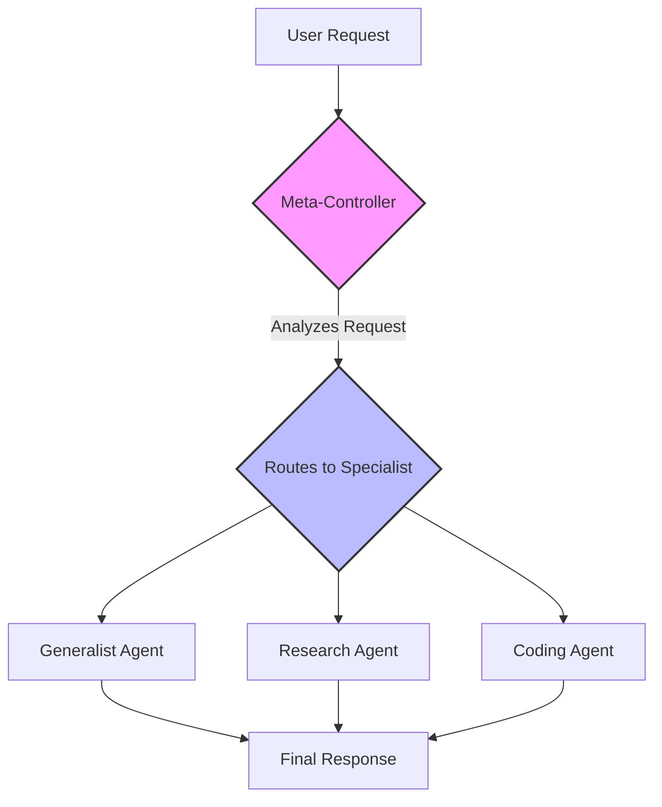

# All Agentic Architectures

    

Добро пожаловать на комплексный практический мастер-класс по **проектированию современных AI агентов**. Этот репозиторий содержит подробные реализации **17+ state-of-the-art архитектур агентов**, созданных с использованием LangChain и LangGraph. Он задуман как "живой учебник", заполняющий пробел между теоретическими концепциями и практическим кодом, готовым к продакшену.

## 📖 Почему этот репозиторий?

Область AI агентов развивается с невероятной скоростью, но многие ресурсы остаются абстрактными и теоретическими. Этот проект был создан, чтобы предоставить структурированный, практический и глубоко образовательный путь для разработчиков, исследователей и энтузиастов AI, позволяющий овладеть искусством создания интеллектуальных систем.

-   **От теории к осязаемому коду:** Каждая архитектура не просто объясняется, но и реализована от начала до конца в запускаемом Jupyter notebook.
-   **Структурированный путь обучения:** Ноутбуки упорядочены так, чтобы последовательно выстраивать концепции, от фундаментальных паттернов до очень продвинутых, многоагентных (multi-agent) и самоосознающих систем.
-   **Акцент на оценке (Evaluation):** Мы не просто создаем агентов, мы их измеряем. Многие ноутбуки содержат надежный паттерн `LLM-as-a-Judge` для обеспечения количественной, объективной обратной связи о производительности агента — критически важный навык для production AI.
-   **Реальные сценарии:** Примеры основаны на практических приложениях — финансовый анализ, кодинг, управление социальными сетями, медицинская сортировка — что делает концепции немедленно применимыми.
-   **Единый, современный фреймворк:** Используя `LangGraph` в качестве основного оркестратора, вы изучите мощный, stateful и циклический подход к проектированию агентов, который быстро становится отраслевым стандартом.

---

## 🏛️ Архитектуры: Глубокое погружение

Эта коллекция охватывает полный спектр современного проектирования агентов, от улучшений одиночных агентов до сложных, взаимодействующих и самосовершенствующихся систем.

| # | Architecture | Core Concept / TL;DR | Key Use Case | Notebook |
|:---:|---|---|---|:---:|
| **01** | **Reflection** | Переходит от однократного генератора к преднамеренному, многоэтапному рассуждающему агенту, критикующему и уточняющему свою собственную работу. | Генерация кода высокого качества, Сложное суммирование | [01_reflection.ipynb](./notebooks/01_reflection.ipynb) |
| **02** | **Tool Use** | Дает агенту возможность преодолеть ограничения знаний (cutoffs) и взаимодействовать с реальным миром, вызывая внешние API и функции. | Ассистенты-исследователи в реальном времени, Корпоративные боты | [02_tool_use.ipynb](./notebooks/02_tool_use.ipynb) |
| **03** | **ReAct** | Динамически чередует рассуждение ("thought") и действие ("tool use") в адаптивном цикле для решения сложных многоэтапных задач. | Multi-hop Q&A, Навигация в Интернете и Исследования | [03_ReAct.ipynb](./notebooks/03_ReAct.ipynb) |
| **04** | **Planning** | Проактивно декомпозирует сложную задачу на детальный пошаговый план *перед* выполнением, обеспечивая структурированный и отслеживаемый рабочий процесс. | Предсказуемая генерация отчетов, Управление проектами | [04_planning.ipynb](./notebooks/04_planning.ipynb) |
| **05** | **Multi-Agent Systems** | Команда специализированных агентов сотрудничает для решения проблемы, разделяя труд для достижения превосходной глубины, качества и структуры конечного результата. | Конвейеры разработки ПО, Творческий мозговой штурм | [05_multi_agent.ipynb](./notebooks/05_multi_agent.ipynb) |
| **06** | **PEV (Plan, Execute, Verify)** | Очень надежный цикл самокоррекции, где агент-верификатор проверяет результат каждого действия, обеспечивая обнаружение ошибок и динамическое восстановление. | Автоматизация с высокими ставками, Финансы, Ненадежные инструменты | [06_PEV.ipynb](./notebooks/06_PEV.ipynb) |
| **07** | **Blackboard Systems** | Гибкая многоагентная система, где агенты сотрудничают ситуативно через общую центральную память ("blackboard"), направляемые динамическим контроллером. | Сложная диагностика, Динамическое осмысление | [07_blackboard.ipynb](./notebooks/07_blackboard.ipynb) |
| **08** | **Episodic + Semantic Memory** | Система двойной памяти, сочетающая векторное хранилище для прошлых разговоров (эпизодическая) и графовую БД для структурированных фактов (семантическая). | Долгосрочные персональные ассистенты, Персонализированные тьюторы | [08_episodic_with_semantic.ipynb](./notebooks/08_episodic_with_semantic.ipynb) |
| **09** | **Tree of Thoughts (ToT)** | Решает проблемы, исследуя множество путей рассуждения в древовидной структуре, оценивая и отсекая ветви для поиска оптимального решения. | Логические головоломки, Планирование с ограничениями | [09_tree_of_thoughts.ipynb](./notebooks/09_tree_of_thoughts.ipynb) |
| **10** | **Mental Loop (Simulator)** | Агент тестирует свои действия во внутренней "ментальной модели" или симуляторе, чтобы предсказать результаты и оценить риск. | Робототехника, Финансовый трейдинг, Критически важные системы безопасности | [10_mental_loop.ipynb](./notebooks/10_mental_loop.ipynb) |
| **11** | **Meta-Controller** | Наблюдающий супервизор, который анализирует поступающие задачи и маршрутизирует их наиболее подходящему специалисту-субагенту. | Мультисервисные платформы AI, Адаптивные ассистенты | [11_meta_controller.ipynb](./notebooks/11_meta_controller.ipynb) |
| **12** | **Graph (World-Model Memory)** | Хранит знания как структурированный граф сущностей и отношений, обеспечивая сложные многоэтапные рассуждения. | Корпоративная разведка, Продвинутые исследования | [12_graph.ipynb](./notebooks/12_graph.ipynb) |
| **13** | **Ensemble** | Несколько независимых агентов анализируют проблему с разных точек зрения, а финальный агент-"агрегатор" синтезирует их выводы. | Поддержка принятия решений с высокими ставками, Проверка фактов | [13_ensemble.ipynb](./notebooks/13_ensemble.ipynb) |
| **14** | **Dry-Run Harness** | Паттерн безопасности, где предлагаемое действие агента сначала симулируется (dry run) и должно быть одобрено перед выполнением. | Развертывание агентов в Production, Отладка | [14_dry_run.ipynb](./notebooks/14_dry_run.ipynb) |
| **15** | **RLHF (Self-Improvement)** | Вывод агента критикуется "редактором", и обратная связь используется для доработки. Лучшие результаты сохраняются для обучения. | Генерация контента высокого качества, Непрерывное обучение | [15_RLHF.ipynb](./notebooks/15_RLHF.ipynb) |
| **16** | **Cellular Automata** | Система простых децентрализованных агентов, чьи локальные взаимодействия создают сложное эмерджентное глобальное поведение. | Пространственное рассуждение, Логистика, Симуляция сложных систем | [16_cellular_automata.ipynb](./notebooks/16_cellular_automata.ipynb) |
| **17** | **Reflexive Metacognitive** | Агент с "self-model", рассуждающий о своих возможностях, выбирая действие, инструмент или эскалацию к человеку. | Консультации с высокими ставками (Медицина, Право, Финансы) | [17_reflexive_metacognitive.ipynb](./notebooks/17_reflexive_metacognitive.ipynb) |
| **18** | **Replan Dynamic** | Plan-Execute-Observe цикл с динамическим перепланированием и глубоким анализом результатов для адаптации к сбоям. | Работа с ненадёжными инструментами, Адаптивные рабочие процессы | [18_replan_dynamic.ipynb](./notebooks/18_replan_dynamic.ipynb) |
| **19** | **LATS/MCTS** | Language Agent Tree Search с Monte Carlo Tree Search для систематического поиска решений с самокритикой и backpropagation. | Сложные задачи рассуждения, Game of 24, Математические головоломки | [19_lats_mcts.ipynb](./notebooks/19_lats_mcts.ipynb) |
| **20** | **Debate Red-team** | Два агента (Advocate и Adversary) ведут структурированные дебаты под наблюдением судьи с обязательным цитированием источников. | Fact-checking, Качественный анализ, AI Safety | [20_debate_redteam.ipynb](./notebooks/20_debate_redteam.ipynb) |
| **21** | **RAG Pipeline** | Полноценный RAG с ингестом, чанкингом, векторным индексом, reranking и верифицируемым цитированием источников. | Q&A системы, Knowledge Bases, Document Search | [21_rag_pipeline.ipynb](./notebooks/21_rag_pipeline.ipynb) |
| **22** | **Contract Net** | Аукционный протокол распределения задач между агентами с bidding, оценкой стоимости/времени и оптимизацией. | Распределённые системы, Load Balancing, Оптимизация ресурсов | [22_contract_net.ipynb](./notebooks/22_contract_net.ipynb) |
| **23** | **Constitutional Guardrails** | Policy-checker с конституцией правил, классификацией действий, dry-run симуляцией и human-in-the-loop одобрением. | Production AI Safety, Compliance, Enterprise AI | [23_constitutional_guardrails.ipynb](./notebooks/23_constitutional_guardrails.ipynb) |

---

## 🗺️ Экскурсия по Архитектурам

Репозиторий структурирован так, чтобы провести вас от простых улучшений к созданию по-настоящему сложных, многоагентных, самоосознающих систем.

<details>
<summary><b>Нажмите, чтобы развернуть путь обучения</b></summary>

#### Часть 1: Фундаментальные Паттерны (Notebooks 1-4)
Этот раздел охватывает основные строительные блоки для усиления одиночного агента.
- Мы начинаем с **Reflection** (Рефлексии) для улучшения качества вывода.
- Затем мы даем агенту **Tools** (Инструменты) для взаимодействия с миром.
- **ReAct** объединяет их в динамический цикл.
- Наконец, **Planning** (Планирование) добавляет предвидение и структуру к его действиям.

#### Часть 2: Многоагентное Сотрудничество (Notebooks 5, 7, 11, 13)
Здесь мы изучаем, как заставить агентов работать вместе.
- **Multi-Agent Systems** вводит концепцию специализированных команд.
- **Meta-Controller** действует как умный маршрутизатор для распределения задач между этими командами.
- **Blackboard** предоставляет гибкое, общее рабочее пространство для динамического сотрудничества.
- Паттерн **Ensemble** использует несколько агентов параллельно для более надежного и разнообразного анализа.

#### Часть 3: Продвинутая Память и Рассуждение (Notebooks 8, 9, 12)
Этот раздел фокусируется на том, как агенты могут думать глубже и запоминать то, что они узнали.
- **Episodic + Semantic Memory** (Эпизодическая + Семантическая память) предоставляет мощную систему памяти, подобную человеческой.
- **Graph World-Model** позволяет проводить сложные рассуждения над взаимосвязанными знаниями.
- **Tree of Thoughts** (Дерево мыслей) обеспечивает систематическое, многовариантное исследование для решения трудных логических задач.

#### Часть 4: Безопасность, Надежность и Взаимодействие с Реальным Миром (Notebooks 6, 10, 14, 17)
Эти архитектуры критически важны для создания агентов, которым можно доверять в продакшене.
- **Dry-Run Harness** предоставляет критически важный слой безопасности "человек в контуре" (human-in-the-loop).
- **Simulator** позволяет агенту "подумать, прежде чем действовать", моделируя последствия.
- **PEV** встраивает автоматическое обнаружение ошибок и восстановление.
- **Metacognitive** (Метакогнитивный) агент понимает свои ограничения, что является ключом к безопасной работе в областях с высокими ставками.

#### Часть 5: Обучение и Адаптация (Notebooks 15, 16)
Финальный раздел исследует, как агенты могут улучшаться со временем и решать задачи новыми способами.
- **Self-Improvement Loop** создает механизм для обучения агента на основе обратной связи, аналогично RLHF.
- **Cellular Automata** демонстрирует, как сложное глобальное поведение может возникать из простых локальных правил, создавая высокоадаптивные системы.

</details>

<details>
<summary><b>Example Architecture Diagram: The Meta-Controller</b></summary>

This diagram illustrates the flow in the `11_meta_controller.ipynb` notebook, a common pattern for orchestrating specialized agents.


</details>

---

## 🛠️ Технический Стек и Настройка

Этот проект использует современный, мощный стек для создания сложных AI-приложений.

| Компонент | Назначение |
|---|---|
| **Python 3.10+** | Основной язык программирования для всего проекта. |
| **LangChain** | Предоставляет фундаментальные строительные блоки для взаимодействия с LLM и инструментами. |
| **LangGraph** | Ключевой фреймворк оркестрации для построения сложных, stateful и циклических рабочих процессов агентов. |
| **Nebius AI Models** | Высокопроизводительные LLM (например, `Mixtral-8x22B-Instruct-v0.1`), которые обеспечивают рассуждения агентов. |
| **Jupyter Notebooks** | Используются для интерактивной разработки, подробных объяснений и понятных пошаговых демонстраций. |
| **Pydantic** | Обеспечивает надежное, структурированное моделирование данных, что критично для надежной коммуникации с LLM. |
| **Tavily Search** | Мощный поисковый API, используемый как инструмент для агентов-исследователей. |
| **Neo4j** | Отраслевой стандарт графовой базы данных, используемый для реализации семантической памяти и world-model memory. |
| **FAISS** | Эффективное векторное хранилище, используемое для реализации эпизодической памяти через поиск по сходству. |

## 🚀 Начало работы

Следуйте этим шагам, чтобы настроить локальное окружение и запустить ноутбуки.

### 1. Клонируйте репозиторий

```bash
git clone https://github.com/your-username/all-agentic-architectures.git
cd all-agentic-architectures
```

### 2. Настройте виртуальное окружение

Настоятельно рекомендуется использовать виртуальное окружение для управления зависимостями.

```bash
# Для Unix/macOS
python3 -m venv venv
source venv/bin/activate

# Для Windows
python -m venv venv
.\venv\Scripts\activate
```

### 3. Установите зависимости

Установите все необходимые пакеты Python из файла `requirements.txt`.

```bash
pip install -r requirements.txt
```

Для визуализации графов в LangGraph вам также может потребоваться установить `pygraphviz`.

### 4. Настройте переменные окружения

Агентам требуются API ключи для работы. Создайте файл с именем `.env` в корневой директории проекта. Вы можете скопировать содержимое `requirements.txt`, чтобы увидеть, что именно нужно, а затем создать свой файл `.env`.

Откройте файл `.env` и добавьте свои учетные данные. Он должен выглядеть так:

```python
# файл .env

# Nebius AI API Key (для доступа к LLM)
NEBIUS_API_KEY="your_nebius_api_key_here"

# LangSmith API Key (для трассировки и отладки)
LANGCHAIN_API_KEY="your_langsmith_api_key_here"
LANGCHAIN_TRACING_V2="true"
LANGCHAIN_PROJECT="All-Agentic-Architectures" # Опционально: Задайте имя проекта

# Tavily Search API Key (для инструмента исследовательского агента)
TAVILY_API_KEY="your_tavily_api_key_here"

# Neo4j Credentials (для архитектур Графов и Памяти)
# У вас должен быть запущен инстанс Neo4j (например, через Docker или Neo4j Desktop)
NEO4J_URI="bolt://localhost:7687"
NEO4J_USERNAME="neo4j"
NEO4J_PASSWORD="your_neo4j_password_here"
```

### 5. Запустите Ноутбуки

Теперь вы можете запустить Jupyter и изучать ноутбуки в числовом порядке.

```bash
jupyter notebook
```