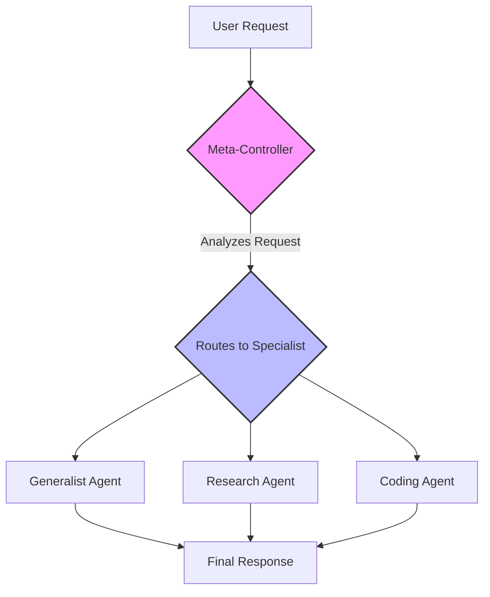

# All Agentic Architectures

[](https://github.com/denis-samatov/agentic_architectures/actions/workflows/ci.yml)
[](https://opensource.org/licenses/MIT)


Welcome to a comprehensive, hands-on masterclass on **designing modern AI agents**. This repository contains detailed implementations of **23 state-of-the-art agent architectures**, built with LangChain and LangGraph. It's designed as a "living textbook" that bridges the gap between theoretical concepts and runnable, educational example code.

## 📖 Why this repository?

The field of AI agents is evolving at an incredible pace, but many resources remain abstract and theoretical. This project was created to provide a structured, practical, and deeply educational path for developers, researchers, and AI enthusiasts to master the art of building intelligent systems.

-   **From theory to tangible code:** Every architecture is not just explained, but implemented end to end in a runnable Jupyter notebook.
-   **A structured learning path:** The notebooks are ordered to build concepts progressively, from foundational patterns to highly advanced, multi-agent, and self-aware systems.
-   **A focus on evaluation:** We don't just build agents, we measure them. Many notebooks include a robust `LLM-as-a-Judge` pattern to provide quantitative, objective feedback on agent performance — a critical skill for production AI.
-   **Real-world scenarios:** Examples are grounded in practical applications — financial analysis, coding, social media management, medical triage — making the concepts immediately applicable.
-   **A single, modern framework:** Using `LangGraph` as the primary orchestrator, you'll learn a powerful, stateful, and cyclical approach to agent design that is quickly becoming the industry standard.

---

## 🏛️ Architectures: A Deep Dive

This collection covers the full spectrum of modern agent design, from single-agent enhancements to complex, interacting, and self-improving systems.

| # | Architecture | Core Concept / TL;DR | Key Use Case | Notebook |
|:---:|---|---|---|:---:|
| **01** | **Reflection** | Moves from a one-shot generator to a deliberate, multi-step reasoning agent that critiques and refines its own work. | High-quality code generation, Complex summarization | [01_reflection.ipynb](./notebooks/01_reflection.ipynb) |
| **02** | **Tool Use** | Gives an agent the ability to overcome knowledge cutoffs and interact with the real world by calling external APIs and functions. | Real-time research assistants, Enterprise bots | [02_tool_use.ipynb](./notebooks/02_tool_use.ipynb) |
| **03** | **ReAct** | Dynamically interleaves reasoning ("thought") and action ("tool use") in an adaptive loop to solve complex, multi-step tasks. | Multi-hop Q&A, Web navigation and research | [03_ReAct.ipynb](./notebooks/03_ReAct.ipynb) |
| **04** | **Planning** | Proactively decomposes a complex task into a detailed, step-by-step plan *before* execution, producing a structured and traceable workflow. | Predictable report generation, Project management | [04_planning.ipynb](./notebooks/04_planning.ipynb) |
| **05** | **Multi-Agent Systems** | A team of specialized agents collaborates to solve a problem, dividing the work to achieve superior depth, quality, and structure in the final result. | Software development pipelines, Creative brainstorming | [05_multi_agent.ipynb](./notebooks/05_multi_agent.ipynb) |
| **06** | **PEV (Plan, Execute, Verify)** | A highly reliable self-correction loop where a verifier agent checks the outcome of every action, enabling error detection and dynamic recovery. | High-stakes automation, Finance, Unreliable tools | [06_PEV.ipynb](./notebooks/06_PEV.ipynb) |
| **07** | **Blackboard Systems** | A flexible multi-agent system where agents collaborate opportunistically through a shared central memory (the "blackboard"), guided by a dynamic controller. | Complex diagnostics, Dynamic sensemaking | [07_blackboard.ipynb](./notebooks/07_blackboard.ipynb) |
| **08** | **Episodic + Semantic Memory** | A dual-memory system combining a vector store for past conversations (episodic) and a graph database for structured facts (semantic). | Long-term personal assistants, Personalized tutors | [08_episodic_with_semantic.ipynb](./notebooks/08_episodic_with_semantic.ipynb) |
| **09** | **Tree of Thoughts (ToT)** | Solves problems by exploring multiple reasoning paths in a tree structure, scoring and pruning branches to find the optimal solution. | Logic puzzles, Constrained planning | [09_tree_of_thoughts.ipynb](./notebooks/09_tree_of_thoughts.ipynb) |
| **10** | **Mental Loop (Simulator)** | The agent tests its actions inside an internal "mental model," or simulator, to predict outcomes and assess risk. | Robotics, Financial trading, Safety-critical systems | [10_mental_loop.ipynb](./notebooks/10_mental_loop.ipynb) |
| **11** | **Meta-Controller** | An overseeing supervisor that analyzes incoming tasks and routes them to the most suitable specialist sub-agent. | Multi-service AI platforms, Adaptive assistants | [11_meta_controller.ipynb](./notebooks/11_meta_controller.ipynb) |
| **12** | **Graph (World-Model Memory)** | Stores knowledge as a structured graph of entities and relationships, enabling complex, multi-step reasoning. | Enterprise intelligence, Advanced research | [12_graph.ipynb](./notebooks/12_graph.ipynb) |
| **13** | **Ensemble** | Several independent agents analyze a problem from different perspectives, and a final "aggregator" agent synthesizes their conclusions. | High-stakes decision support, Fact-checking | [13_ensemble.ipynb](./notebooks/13_ensemble.ipynb) |
| **14** | **Dry-Run Harness** | A safety pattern in which an agent's proposed action is first simulated (dry run) and must be approved before execution. | Deploying agents to production, Debugging | [14_dry_run.ipynb](./notebooks/14_dry_run.ipynb) |
| **15** | **RLHF (Self-Improvement)** | An agent's output is critiqued by an "editor," and the feedback is used for refinement. The best results are kept for training. | High-quality content generation, Continuous learning | [15_RLHF.ipynb](./notebooks/15_RLHF.ipynb) |
| **16** | **Cellular Automata** | A system of simple, decentralized agents whose local interactions produce complex, emergent global behavior. | Spatial reasoning, Logistics, Complex-system simulation | [16_cellular_automata.ipynb](./notebooks/16_cellular_automata.ipynb) |
| **17** | **Reflexive Metacognitive** | An agent with a "self-model" that reasons about its own capabilities, choosing between acting, using a tool, or escalating to a human. | High-stakes consultation (medicine, law, finance) | [17_reflexive_metacognitive.ipynb](./notebooks/17_reflexive_metacognitive.ipynb) |
| **18** | **Replan Dynamic** | A Plan-Execute-Observe loop with dynamic replanning and deep result analysis to adapt to failures. | Working with unreliable tools, Adaptive workflows | [18_replan_dynamic.ipynb](./notebooks/18_replan_dynamic.ipynb) |
| **19** | **LATS/MCTS** | Language Agent Tree Search combined with Monte Carlo Tree Search for systematic solution search with self-critique and backpropagation. | Complex reasoning tasks, Game of 24, Math puzzles | [19_lats_mcts.ipynb](./notebooks/19_lats_mcts.ipynb) |
| **20** | **Debate Red-team** | Two agents (Advocate and Adversary) hold a structured debate under a judge's supervision, with mandatory source citation. | Fact-checking, Qualitative analysis, AI safety | [20_debate_redteam.ipynb](./notebooks/20_debate_redteam.ipynb) |
| **21** | **RAG Pipeline** | A full RAG pipeline with ingestion, chunking, a vector index, reranking, and verifiable source citation. | Q&A systems, Knowledge bases, Document search | [21_rag_pipeline.ipynb](./notebooks/21_rag_pipeline.ipynb) |
| **22** | **Contract Net** | An auction-based protocol for distributing tasks among agents, with bidding, cost/time estimation, and optimization. | Distributed systems, Load balancing, Resource optimization | [22_contract_net.ipynb](./notebooks/22_contract_net.ipynb) |
| **23** | **Constitutional Guardrails** | A policy checker with a constitution of rules, action classification, dry-run simulation, and human-in-the-loop approval. | Production AI safety, Compliance, Enterprise AI | [23_constitutional_guardrails.ipynb](./notebooks/23_constitutional_guardrails.ipynb) |

---

## 🗺️ A Tour of the Architectures

The repository is structured to walk you from simple enhancements to building truly complex, multi-agent, self-aware systems.

<details>
<summary><b>Click to expand the learning path</b></summary>

#### Part 1: Foundational Patterns (Notebooks 1-4)
This section covers the core building blocks for enhancing a single agent.
- We start with **Reflection** to improve output quality.
- Then we give the agent **Tools** to interact with the world.
- **ReAct** combines these into a dynamic loop.
- Finally, **Planning** adds foresight and structure to its actions.

#### Part 2: Multi-Agent Collaboration (Notebooks 5, 7, 11, 13)
Here we explore how to make agents work together.
- **Multi-Agent Systems** introduces the concept of specialized teams.
- **Meta-Controller** acts as an intelligent router, distributing tasks across those teams.
- **Blackboard** provides a flexible, shared workspace for dynamic collaboration.
- The **Ensemble** pattern runs multiple agents in parallel for more reliable and diverse analysis.

#### Part 3: Advanced Memory and Reasoning (Notebooks 8, 9, 12)
This section focuses on how agents can think more deeply and remember what they've learned.
- **Episodic + Semantic Memory** provides a powerful, human-like memory system.
- **Graph World-Model** enables complex reasoning over interconnected knowledge.
- **Tree of Thoughts** provides systematic, multi-path exploration for solving hard logical problems.

#### Part 4: Safety, Reliability, and Real-World Interaction (Notebooks 6, 10, 14, 17)
These architectures are critical for building agents that can be trusted in production.
- **Dry-Run Harness** provides a critical human-in-the-loop safety layer.
- **Simulator** lets an agent "think before it acts" by modeling consequences.
- **PEV** builds in automatic error detection and recovery.
- The **Metacognitive** agent understands its own limitations, which is key to safe operation in high-stakes domains.

#### Part 5: Learning and Adaptation (Notebooks 15, 16)
The final section explores how agents can improve over time and solve problems in new ways.
- **Self-Improvement Loop** builds a mechanism for the agent to learn from feedback, similar to RLHF.
- **Cellular Automata** demonstrates how complex global behavior can emerge from simple local rules, producing highly adaptive systems.

</details>

<details>
<summary><b>Example Architecture Diagram: The Meta-Controller</b></summary>

This diagram illustrates the flow in the `11_meta_controller.ipynb` notebook, a common pattern for orchestrating specialized agents.


```mermaid
graph TD
    A[User Request] --> B{Meta-Controller};
    B -- Analyzes Request --> C{Routes to Specialist};
    C --> D[Generalist Agent];
    C --> E[Research Agent];
    C --> F[Coding Agent];
    D --> G[Final Response];
    E --> G[Final Response];
    F --> G[Final Response];

    style B fill:#f9f,stroke:#333,stroke-width:2px
    style C fill:#bbf,stroke:#333,stroke-width:2px
```
</details>

---

## 🛠️ Tech Stack and Setup

This project uses a modern, powerful stack for building sophisticated AI applications.

| Component | Purpose |
|---|---|
| **Python 3.10+** | The primary programming language for the whole project. |
| **LangChain** | Provides the fundamental building blocks for interacting with LLMs and tools. |
| **LangGraph** | The core orchestration framework for building complex, stateful, cyclical agent workflows. |
| **Nebius AI Models** | High-performance LLMs (e.g. `Mixtral-8x22B-Instruct-v0.1`) that power agent reasoning. |
| **Jupyter Notebooks** | Used for interactive development, detailed explanations, and clear step-by-step demos. |
| **Pydantic** | Provides robust, structured data modeling, critical for reliable communication with LLMs. |
| **Tavily Search** | A powerful search API used as a tool by research agents. |
| **Neo4j** | An industry-standard graph database, used to implement semantic memory and world-model memory. |
| **FAISS** | An efficient vector store, used to implement episodic memory via similarity search. |

## 🚀 Getting Started

Follow these steps to set up your local environment and run the notebooks.

### 1. Clone the repository

```bash
git clone https://github.com/your-username/all-agentic-architectures.git
cd all-agentic-architectures
```

### 2. Set up a virtual environment

Using a virtual environment to manage dependencies is strongly recommended.

```bash
# On Unix/macOS
python3 -m venv venv
source venv/bin/activate

# On Windows
python -m venv venv
.\venv\Scripts\activate
```

### 3. Install dependencies

Install all required Python packages from `requirements.txt`.

```bash
pip install -r requirements.txt
```

You may also need to install `pygraphviz` to visualize LangGraph graphs.

> **Note:** `requirements.txt` is the authoritative dependency list — install from it as shown above. `pyproject.toml` in this repo only configures `ruff` (linting/formatting) and declares no dependencies or build metadata.

### 4. Configure environment variables

The agents need API keys to run. Create a file named `.env` in the project root. You can look at `requirements.txt` to see what's needed, then build your own `.env` file.

Open the `.env` file and add your credentials. It should look like this:

```python
# .env file

# Nebius AI API Key (for LLM access)
NEBIUS_API_KEY="your_nebius_api_key_here"

# LangSmith API Key (for tracing and debugging)
LANGCHAIN_API_KEY="your_langsmith_api_key_here"
LANGCHAIN_TRACING_V2="true"
LANGCHAIN_PROJECT="All-Agentic-Architectures" # Optional: set a project name

# Tavily Search API Key (for the research agent's tool)
TAVILY_API_KEY="your_tavily_api_key_here"

# Neo4j Credentials (for the Graph and Memory architectures)
# You need a running Neo4j instance (e.g. via Docker or Neo4j Desktop)
NEO4J_URI="bolt://localhost:7687"
NEO4J_USERNAME="neo4j"
NEO4J_PASSWORD="your_neo4j_password_here"
```

### 5. Run the notebooks

You can now start Jupyter and explore the notebooks in numerical order.

```bash
jupyter notebook
```
